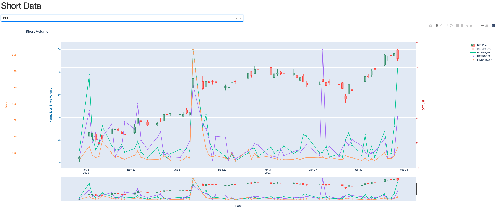

# short_volume
Short volume charting app... Created after reading: https://www.reddit.com/r/wallstreetbets/comments/li5vch/i_think_i_found_a_way_to_predict_dips_with_nasdaq/

First thing I thought of, was:
> Correlation does not imply causation... 

Never the less, I had a bit of time to throw this together to quickly check various stocks


1. create a python3 virtual env using your favorite method: `virtualenv -p python3 short_venv`
1. activate: `source short_venv/bin/activate`
1. run `pip3 install -r requirements.txt`
1. run `python populate_short_data.py -d 100`. this will get data for the last 100 days.
    This should create a sqlite DB file in the current directory where you executed the script. You can run this multiple times, it will update existing data in the db.
1. run `python render_chart.py`
```bash
usage: render_chart.py [-h] [-a APITOKEN] -d DB

Put together some charts!!!

optional arguments:
  -h, --help            show this help message and exit
  -a APITOKEN, --apitoken APITOKEN
                        tiingo api key
  -d DB, --db DB        path to sqlite db file created with
                        'populate_short_data.py'
```
If you want close/open/high/low price information, please create an account here: https://api.tiingo.com/account/api/token
Then copy your API key and pass it via the command line argument `-a`.

```bash
./render_chart.py -a 1234567890d420a40b63141cbed75f928b9812345 -d stockdata.sqlite
```
You should now see something like this:
```
Dash is running on http://127.0.0.1:8050/

 * Serving Flask app "render_chart" (lazy loading)
 * Environment: production
   WARNING: This is a development server. Do not use it in a production deployment.
   Use a production WSGI server instead.
 * Debug mode: on
Pick Symbol to track
```

1. Open http://127.0.0.1:8050/ in your browser and select the symbol from the drop down.

1. run `populate_short_data.py -d 2` every day to stay up to date with the latest data.

### Browse/Query DB data yourself
I recommend https://sqlitebrowser.org/ which can be used to look at the data in the DB. There are SQL queries in the code that you can use as examples.

### Screen Shot



